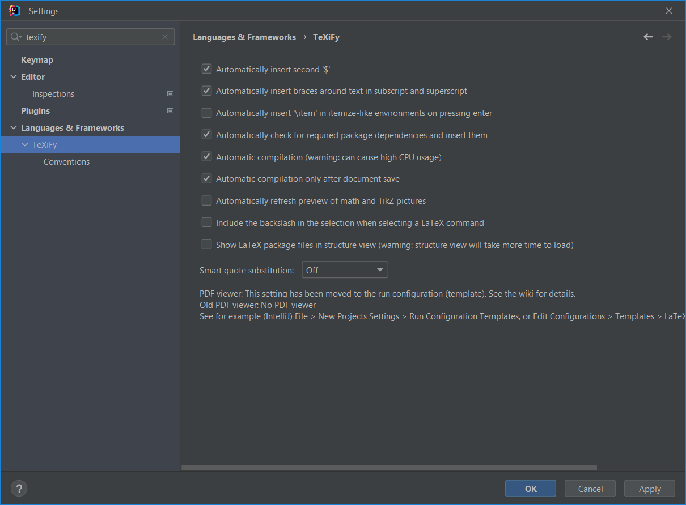
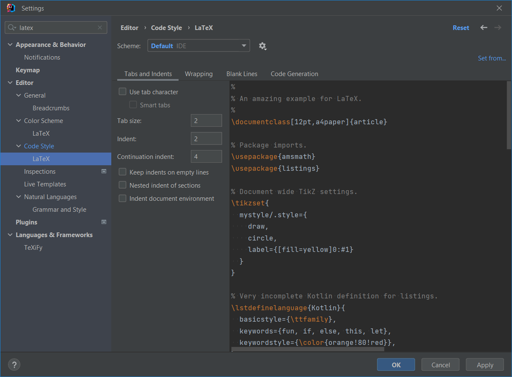
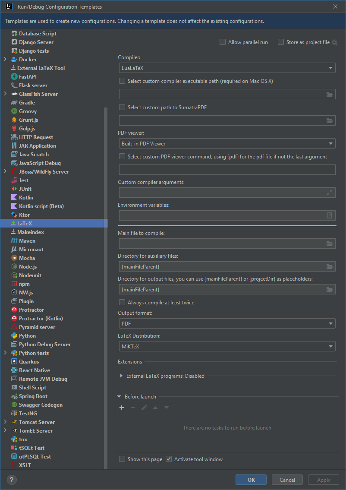

# RIP Atom. How to set up IntelliJ IDEA as a LaTeX editor

As of 15 december 2022, [Atom](https://github.blog/2022-06-08-sunsetting-atom/) will archived by GitHub. There will be no more security updates and package management will stop working. This is too bad, because I have enjoyed working with the tool for some years now. Mainly to write academic texts and documentation using LaTeX. I will need to reconfigure my workflow.

There are many LaTeX editors, each with their own enthusiastic user base. Popular tools include [Vim](https://www.vim.org/) (or [Neovim](https://neovim.io/), [SpaceVim](https://spacevim.org/)), [Sublime](https://sublime.nl/), [Kate](https://kate-editor.org/nl/), [Zed](https://zed.dev/), [Emacs](https://www.gnu.org/software/emacs/), [VS Code](https://code.visualstudio.com/) or the good old terminal (or two: one two write LaTeX in and one to compile the document). There are also cloud solutions with [Overleaf](https://www.overleaf.com/) the best-known one. I won't argue for one tool or the other. You do you!

The solution that I've found is IntelliJ IDEA. The reason I have set up this as my LaTeX editor is that I use the IDE already practically every day to code in. In this post, I will explain what I have done to set up IntelliJ as a LaTeX editor.

## Requirements

* You have installed [IntelliJ IDEA](https://www.jetbrains.com/idea/). I suppose the steps below will work for PyCharm and other IntelliJ-based IDEs as well, but I have not personally tested this.
* You have installed a LaTeX distribution. I use [MiKTeX](https://miktex.org/) for no particular reason. Feel free to choose one of your liking. The compiler I use at the moment is LuaLaTeX, also 

## Installation

Please install the following plugins:

* [TeXiFy IDEA](https://plugins.jetbrains.com/plugin/9473-texify-idea) provides syntax highlighting, compiler support, autocompletion, etc.
* [PDF Viewer](https://plugins.jetbrains.com/plugin/14494-pdf-viewer) integrates well with TeXiFy. It highlights the paragraph you are working on. The document will reload on change. It also allows document navigation using hyperlinks and search.

## Configuration

### TeXiFy settings

Go to settings (`Ctrl + Alt + S`) and navigate to Languages & Frameworks > TeXiFy.

I am using the following TeXiFy settings:
* I want to automatically compile the document on save.
* Personally, I didn't want the editor to automatically insert `\item` when pressing enter in `itemize` and `enumerate`.

Additionally, I added `; *.tex` to 'Soft wrap these files:' in Settings > Editor > General > Soft Wraps.

### LaTeX code style settings

I like a little less indentation in my LaTeX-documents.
* I divided the tab and indent settings by 2.
* I disabled indent document environment.

You can find these settings in Settings > Editor > Code Style > Latex > Tabs and Indents.

### Configuration template

By default, TeXiFy generates and fills `auxil` and `out` folders for auxiliary files and output. I wish to have these in the folder of the `.tex` file that I want to compile. To that order, I set the file paths to `{mainFileParent}` as in the image below. To change these settings, navigate to File > New Projects Setup > Run Configuration Templates... 

### You are all set

Enjoy!
